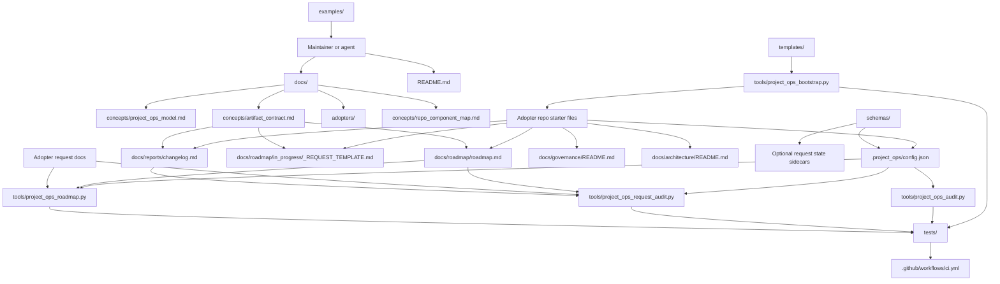

# Repo Component Map

Project Ops is a reusable operations kit for other repositories. It provides
seed documentation, schemas, templates, and read-only checks that help an
adopter repo keep its work understandable.

The shortest version:

```text
Project Ops repo -> reusable structure and validators
Adopter repo     -> actual project decisions, history, roadmap, and evidence
```

## Component Picture



## What Each Part Does

| Component | Role | Connects to |
| --- | --- | --- |
| `README.md` | Public entry point for what Project Ops is and how to start. | Links to adopter docs, templates, schemas, and tools. |
| `docs/` | Human guidance for the operating model, adoption, configuration, and execution loop. | Explains how adopters use templates, config, and audits. |
| `docs/concepts/project_ops_model.md` | Defines the boundary between reusable Project Ops material and adopter-owned history. | Supports adopter docs and this component map. |
| `docs/concepts/artifact_contract.md` | Defines stable IDs and shared state fields across requests, roadmap, changelog, RFC-lite decisions, handoffs, and postmortems. | Gives docs, templates, and tools one traceability contract. |
| `docs/adopters/` | Practical onboarding docs for new or existing adopter repos. | Points to bootstrap, config, request flow, and audits. |
| `templates/` | Copyable Markdown and baseline files for starter project operations. | Consumed by bootstrap and copied into adopter repos. |
| `schemas/project_config.schema.json` | Contract for `.project_ops/config.json`. | Used by humans and tools to understand project-local paths, validation, privacy, and bootstrap expectations. |
| `schemas/request_state.schema.json` | Optional machine-readable sidecar contract for request state. | Complements the human Markdown request artifact. |
| `tools/project_ops_bootstrap.py` | Dry-run-first file creator for blank or lightly prepared repos. It creates only missing files. | Reads templates and emits starter adopter files. |
| `tools/project_ops_audit.py` | Read-only adoption readiness checker. | Reads `.project_ops/config.json` and verifies required files, configured paths, privacy shape, and bootstrap expectations. |
| `tools/project_ops_request_audit.py` | Read-only request parity and readiness checker. | Reads config, one request artifact, roadmap, and changelog to check state alignment and pre-execution readiness. |
| `tools/project_ops_roadmap.py` | Read-only roadmap parity checker. | Reads config, all configured request artifacts, and the roadmap to check State Summary alignment. |
| `examples/` | Synthetic adopter fixtures and minimal config examples. | Shows what a bootstrapped repo can look like without exposing real project history. |
| `tests/` | Regression tests for bootstrap and audit behavior. | Exercised by CI. |
| `.github/workflows/ci.yml` | Project Ops repo CI. | Compiles tools, runs tests, and audits the minimal example. |

## Connection Rules

- Docs explain intent and give humans the operating map.
- The artifact contract defines the shared IDs and State Summary fields that
  let every subsystem point at the same work.
- Schemas define the machine-readable contracts.
- Templates define the human artifact shapes.
- Config binds Project Ops defaults to adopter-local paths and policies.
- Tools consume config and artifacts in read-only mode.
- Examples show the smallest complete adopter shape.
- Tests protect the bootstrap and audit behavior that adopters depend on.

No subsystem should require hidden knowledge from another subsystem. If a tool
needs a path, it should come from config. If a contributor needs process, it
should be in `docs/project_ops.md`, roadmap, governance, or the request
artifact. If reusable behavior changes, examples and tests should make the new
contract visible.

## Main Data Flow

1. A maintainer reads the README and adopter docs.
2. The maintainer runs bootstrap in dry-run mode against an adopter repo.
3. Bootstrap reads Project Ops templates and writes only missing starter files
   when `--apply` is used.
4. The adopter edits `.project_ops/config.json` to reflect local paths, scope
   labels, privacy posture, validation commands, and bootstrap expectations.
5. The adopter creates request artifacts from the request template.
6. The adopter carries the same Request ID through roadmap, changelog,
   RFC-lite decisions, handoffs, and closeout notes.
7. The adopter updates local roadmap and changelog files as work progresses.
8. Audit tools read the adopter repo and report structure, readiness, or parity problems.

## Request State Flow

```text
request template
  -> request artifact
  -> roadmap entry
  -> RFC-lite decision when a tradeoff blocks readiness
  -> changelog breadcrumb
  -> request audit
  -> roadmap check
  -> handoff or closeout
```

The request artifact is the source of current work state. The roadmap makes
that work visible in the project plan. The changelog records meaningful
outcomes. RFC-lite records choices that otherwise cause rework later.
`tools/project_ops_request_audit.py` checks one request deeply;
`tools/project_ops_roadmap.py` checks the request collection against the
roadmap so another person or agent can resume work without reconstructing state.

## What This Repo Does

- Provides a reusable administrative skeleton for project repos.
- Gives adopters copyable templates for roadmap, request, changelog,
  governance, architecture, handoff, post-mortem, and phase-exit artifacts.
- Defines project-local configuration with a versioned JSON Schema ID.
- Bootstraps missing files into an adopter repo without overwriting existing
  project-owned files.
- Audits Project Ops adoption readiness in read-only mode.
- Audits one request artifact against roadmap, changelog, and readiness state.
- Audits all configured request artifacts against roadmap State Summary entries.
- Uses stable Request IDs as the trace through roadmap, changelog, decision,
  handoff, and post-mortem artifacts.
- Provides synthetic examples and tests for the reusable behavior.

## What This Repo Does Not Do

- It does not manage the adopter's product roadmap for them.
- It does not decide architecture, priorities, ownership, release policy, or
  validation commands for an adopter.
- It does not store real adopter request history, reports, private notes, or
  validation evidence.
- It does not rewrite existing adopter files during bootstrap.
- It does not automatically sync request, roadmap, and changelog content.
- It does not provide an installable package or console command yet.
- It does not provide a ready-made adopter CI workflow yet.
- It does not enforce schema validation through a JSON Schema engine yet; the
  current audit tool performs its own focused shape checks.

## User-Facing Promise

Project Ops helps a repository answer operational questions early:

- Which project docs should exist?
- Where do requests, roadmap entries, changelog notes, and governance docs live?
- Which files are public, private, or internal?
- Which validation commands prove the repo is healthy?
- What should a contributor or agent read before changing the project?
- How can a paused request be resumed without reconstructing context?
- Which decision or readiness blocker explains why work should not start yet?

The adopter still owns the answers. Project Ops provides the structure, starter
files, and checks that make those answers durable.
